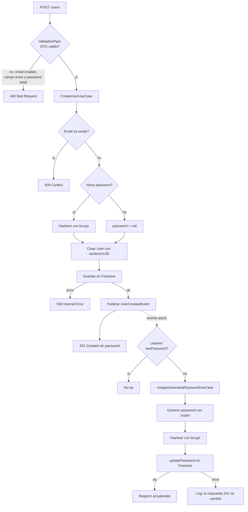
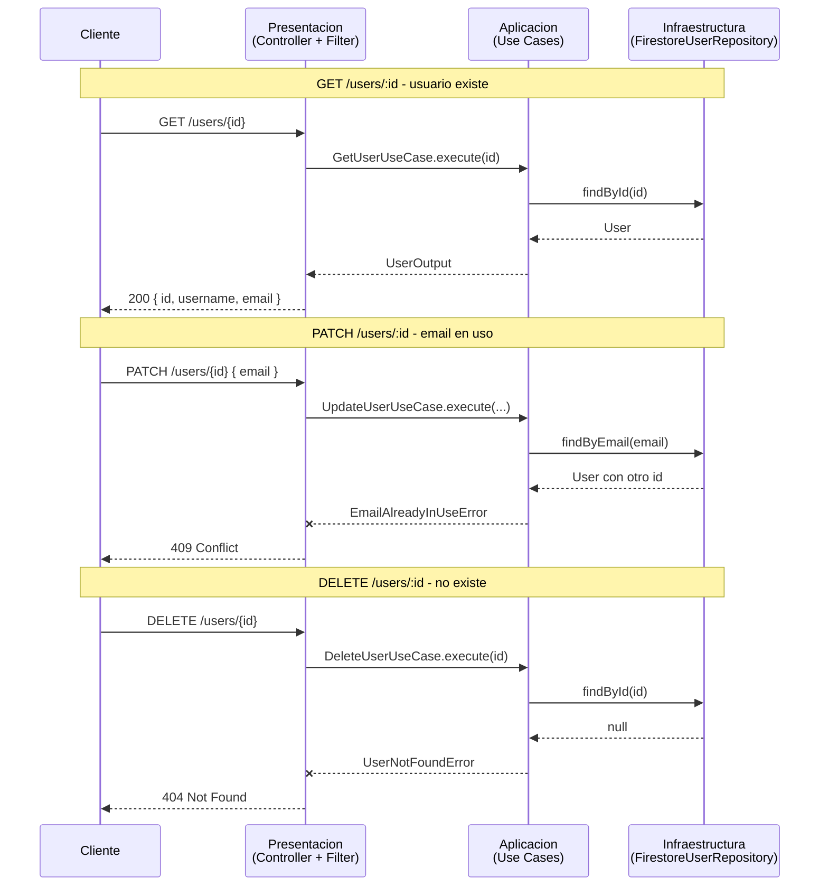
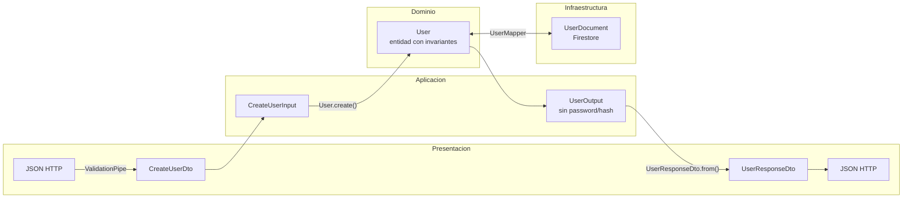
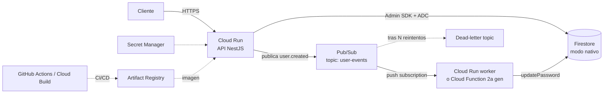

# nestjs-firebase-clean-arch

REST API de usuarios con NestJS, Firestore y Clean Architecture.

Proyecto para una prueba tecnica backend. Permite capturar usuarios en
Firestore y, cuando se crea un usuario sin `password`, dispara un evento que
genera un password seguro, lo hashea y actualiza el registro.

## Descripcion

La API expone CRUD de usuarios:

- Crear usuario con o sin password.
- Listar usuarios con paginacion.
- Obtener usuario por id.
- Actualizar `username` y/o `email`.
- Eliminar usuario.

Ninguna respuesta HTTP expone `password` ni hash. Si el usuario se crea sin
password, el flujo asincrono lo asigna despues mediante el evento
`user.created`.

## Stack

- TypeScript
- NestJS
- Firebase Admin SDK
- Cloud Firestore
- Firebase Emulator Suite
- `@nestjs/event-emitter`
- `crypto` de Node.js para generar passwords
- `bcrypt` para hashear passwords
- Jest + Supertest
- ESLint + Prettier

## Indice

- [Arquitectura](#arquitectura)
- [Flujo del evento](#flujo-del-evento)
- [Procesos CRUD y errores](#procesos-crud-y-errores)
- [Transformacion de datos](#transformacion-de-datos)
- [Requisitos](#requisitos)
- [Variables de entorno](#variables-de-entorno)
- [Instalacion](#instalacion)
- [Ejecutar localmente](#ejecutar-localmente)
- [Endpoints](#endpoints)
- [Probar con REST Client](#probar-con-rest-client)
- [Tests](#tests)
- [CI](#ci)
- [Firebase y emulador](#firebase-y-emulador)
- [Decisiones tecnicas](#decisiones-tecnicas)
- [Limitaciones conocidas](#limitaciones-conocidas)
- [Despliegue en GCP](#despliegue-en-gcp)

## Arquitectura

El proyecto usa Clean Architecture con dependencias hacia adentro:

```text
domain <- application <- infrastructure / presentation
```

```text
src/
├── domain/          # reglas puras: entidad, errores, puertos y eventos
├── application/     # casos de uso y DTOs internos
├── infrastructure/  # Firestore, bcrypt, crypto y publicador de eventos
├── presentation/    # controllers HTTP, DTOs, filtros y listener de eventos
├── app.module.ts
└── main.ts
```

Que hace cada capa y por que existe:

| Capa | Que contiene | Por que existe |
|---|---|---|
| `domain` | La entidad `User`, errores de negocio, puertos (`UserRepository`, `PasswordHasher`, `PasswordGenerator`, `EventPublisher`) y el evento `UserCreatedEvent`. | Es el nucleo del negocio. No sabe nada de NestJS, Firebase, HTTP ni bcrypt, asi que sus reglas se pueden probar sin levantar infraestructura y no cambian si se reemplaza Firestore por otra base de datos. |
| `application` | Casos de uso: crear usuario, listar, obtener, actualizar, eliminar y asignar password generado. Tambien contiene DTOs internos como `CreateUserInput` y `UserOutput`. | Orquesta el negocio: valida reglas como email duplicado, decide cuando publicar el evento y coordina puertos. No implementa detalles tecnicos; solo dice que necesita guardar, hashear, generar o publicar. |
| `infrastructure` | Adaptadores concretos: `FirestoreUserRepository`, `BcryptPasswordHasher`, `CryptoPasswordGenerator`, configuracion de Firebase y publicador con EventEmitter. | Encapsula herramientas externas. Si cambia Firebase, bcrypt o la forma de publicar eventos, el cambio queda aqui y no contamina dominio ni casos de uso. |
| `presentation` | Entrada y salida de la aplicacion: `UserController`, DTOs HTTP con `class-validator`, `DomainExceptionFilter` y `UserCreatedListener`. | Traduce el mundo externo hacia la aplicacion. HTTP, validaciones de formato, codigos de respuesta y decoradores de NestJS viven aqui para no mezclar framework con negocio. |

Esta separacion evita el controller "hace todo": el controller solo recibe la
request y llama un caso de uso; el caso de uso aplica la regla; infraestructura
guarda o hashea; dominio conserva las reglas puras. Tambien evita filtrar
passwords por accidente, porque los modelos de salida (`UserOutput` y
`UserResponseDto`) no tienen campo `password`.

## Flujo del evento

Protecciones del evento:

- Se publica solo despues de crear el usuario.
- `updatePassword` no publica eventos, por eso no hay ciclo.
- El listener ignora eventos con `hasPassword = true`.
- `AssignGeneratedPasswordUseCase` relee el usuario y no hace nada si ya tiene
  password; esto evita duplicados y ejecuciones repetidas.

Flujo completo con validaciones y errores principales:



La linea punteada marca la frontera asincrona: el cliente recibe `201` despues
de crear el usuario; la asignacion de password ocurre fuera del ciclo
request/response.

## Procesos CRUD y errores

Los casos de uso lanzan errores propios del dominio. Solo la capa de
presentacion los convierte a HTTP con `DomainExceptionFilter`.



## Transformacion de datos

Cada capa usa su propia representacion para evitar que detalles externos se
filtren hacia el dominio o hacia las respuestas HTTP.



El punto clave: `UserOutput` y `UserResponseDto` no tienen campo `password`.
No se borra el password al final; simplemente no existe en el modelo de salida.

## Requisitos

- Node.js 22 recomendado.
- npm.
- Java 21 o superior para Firebase Emulator Suite.
- Firebase CLI via `npx firebase ...` o el paquete local `firebase-tools`.

Nota: versiones recientes de `firebase-tools` ya no soportan Java menor a 21
para arrancar emuladores. Con Java 17, `firebase emulators:exec` puede fallar
antes de ejecutar los tests.

## Variables de entorno

Crea el archivo local:

```bash
cp .env.example .env
```

Variables usadas:

```env
PORT=3000
FIREBASE_PROJECT_ID=demo-nestjs-firebase-clean-arch
FIRESTORE_EMULATOR_HOST=localhost:8080
BCRYPT_SALT_ROUNDS=10
```

Para desarrollo local se usa el proyecto demo
`demo-nestjs-firebase-clean-arch`; no necesitas credenciales reales si apuntas
al emulador.

## Instalacion

```bash
npm install
```

## Ejecutar localmente

Terminal 1: levanta Firestore Emulator.

```bash
npm run emulators
```

Terminal 2: levanta NestJS.

```bash
npm run start:dev
```

La API queda en:

```text
http://localhost:3000
```

Si el puerto `8080` ya esta ocupado:

```bash
lsof -nP -iTCP:8080 -sTCP:LISTEN
kill <PID>
```

## Endpoints

### Crear usuario con password

```bash
curl -X POST http://localhost:3000/users \
  -H "Content-Type: application/json" \
  -d '{
    "username": "cristian",
    "email": "cristian@example.com",
    "password": "Secret123!"
  }'
```

Respuesta `201`:

```json
{
  "id": "uuid",
  "username": "cristian",
  "email": "cristian@example.com",
  "createdAt": "2026-07-15T00:00:00.000Z",
  "updatedAt": "2026-07-15T00:00:00.000Z"
}
```

### Crear usuario sin password

```bash
curl -X POST http://localhost:3000/users \
  -H "Content-Type: application/json" \
  -d '{
    "username": "ada",
    "email": "ada@example.com"
  }'
```

La respuesta tampoco incluye password. El listener procesa `user.created` y
actualiza el documento en Firestore con un hash bcrypt.

### Listar usuarios

```bash
curl "http://localhost:3000/users?page=1&limit=10"
```

### Obtener usuario por id

```bash
curl http://localhost:3000/users/<USER_ID>
```

### Actualizar usuario

```bash
curl -X PATCH http://localhost:3000/users/<USER_ID> \
  -H "Content-Type: application/json" \
  -d '{
    "username": "cristian updated",
    "email": "updated@example.com"
  }'
```

`PATCH /users/:id` no acepta `password`; el password solo se asigna al crear o
por el listener del evento.

### Eliminar usuario

```bash
curl -X DELETE http://localhost:3000/users/<USER_ID>
```

Respuesta esperada: `204 No Content`.

### Respuestas de error

Error de validacion (`400 Bad Request`) cuando el body no cumple los DTOs:

```bash
curl -X POST http://localhost:3000/users \
  -H "Content-Type: application/json" \
  -d '{
    "username": "",
    "email": "correo-invalido"
  }'
```

```json
{
  "message": [
    "El nombre de usuario es obligatorio",
    "El email debe tener un formato válido"
  ],
  "error": "Bad Request",
  "statusCode": 400
}
```

Usuario inexistente (`404 Not Found`) traducido por `DomainExceptionFilter`:

```json
{
  "statusCode": 404,
  "error": "NOT_FOUND",
  "message": "Usuario no encontrado: <USER_ID>"
}
```

Email duplicado (`409 Conflict`) traducido por `DomainExceptionFilter`:

```json
{
  "statusCode": 409,
  "error": "CONFLICT",
  "message": "El email ya está en uso: cristian@example.com"
}
```

## Probar con REST Client

Hay una coleccion minima en [`docs/users.http`](docs/users.http). Abrela con la
extension REST Client de VS Code o compatible.

Actualiza la variable `@userId` con un id creado por `POST /users` antes de
ejecutar los requests de obtener, actualizar o eliminar.

## Tests

Unitarios:

```bash
npm test -- --runInBand
```

E2E con el emulador ya activo:

```bash
npm run test:e2e -- --runInBand
```

E2E levantando y apagando el emulador automaticamente:

```bash
npm run emulators:exec -- "npm run test:e2e -- --runInBand"
```

Validacion general:

```bash
npm run lint
npm run build
```

## CI

`.github/workflows/ci.yml` corre en Pull Requests y pushes a `main`.

Validaciones:

- `npm ci`
- `npm run lint`
- `npm test`
- `npm run test:cov`
- `npm run build`

## Firebase y emulador

Archivos relevantes:

- `.firebaserc`: proyecto demo local.
- `firebase.json`: configuracion de Firestore y emuladores.
- `firestore.rules`: reglas de seguridad.
- `firestore.indexes.json`: indices.

Este proyecto usa solo Cloud Firestore. No usa Firebase Auth, Cloud Functions,
Storage ni Messaging porque no hacen falta para el alcance de la prueba.

Si necesitas rehacer la configuracion:

```bash
npx firebase login
npx firebase init
```

Selecciona Firestore y Emulator Suite; para emuladores, selecciona Firestore.

## Decisiones tecnicas

### Firestore como base de datos

Se usa Cloud Firestore porque Firebase era requisito de la prueba y Firestore
encaja bien con una entidad documental como `User`. Realtime Database se
descarto porque su modelo de arbol JSON y sus consultas son menos convenientes
para este caso.

### Firebase Admin SDK

La API usa `firebase-admin`, no el SDK cliente. Es el SDK correcto para backend:
trabaja con credenciales de servidor, soporta el emulador con
`FIRESTORE_EMULATOR_HOST` y evita meter detalles de cliente dentro del dominio.

### Clean Architecture y puertos

Los casos de uso no importan Firebase, NestJS ni bcrypt. Trabajan contra
puertos del dominio como `UserRepository`, `PasswordHasher`,
`PasswordGenerator` y `EventPublisher`. Las implementaciones concretas viven en
infraestructura.

### Evento in-process

El evento `user.created` se maneja con `@nestjs/event-emitter`. Se eligio esta
opcion porque mantiene el proyecto NestJS autocontenido y demuestra
desacoplamiento sin agregar Pub/Sub, Redis o Cloud Functions para una prueba
local.

Alternativas descartadas:

- Cloud Functions con trigger de Firestore: seria valido en produccion, pero
  saca la logica fuera del proyecto NestJS.
- Generar el password dentro del create de forma sincrona: no cumple la parte
  de evento solicitada.
- Cola externa: demasiado para el alcance.

### Password seguro

`bcrypt` no genera passwords; los hashea. Por eso el proyecto separa dos
responsabilidades:

- `CryptoPasswordGenerator` genera el password con CSPRNG de Node.js.
- `BcryptPasswordHasher` guarda solo el hash bcrypt.

El password plano nunca se expone en respuestas HTTP ni se persiste.

### Idempotencia y ciclos

El evento no nace de Firestore; lo publica `CreateUserUseCase` una sola vez
despues de `create`. `updatePassword` no publica eventos, asi que la
actualizacion del password no puede crear un ciclo.

Si el mismo evento se procesa dos veces, `AssignGeneratedPasswordUseCase` relee
el usuario y retorna si ya tiene password. Esto evita duplicados, ejecuciones
repetidas y sobrescrituras.

### IDs generados por la aplicacion

El `id` se genera con `crypto.randomUUID()` antes de persistir y se usa como id
del documento en Firestore. Asi la entidad ya tiene identidad dentro de la capa
de aplicacion y el evento puede transportar `userId` sin depender de un retorno
especial de Firestore.

### Validacion y errores

Los DTOs de presentacion validan formato con `class-validator` y
`ValidationPipe`. Las reglas de negocio viven en dominio/aplicacion. Los
errores propios (`UserNotFoundError`, `EmailAlreadyInUseError`,
`InvalidUserDataError`) se traducen a HTTP en `DomainExceptionFilter`.

### Alcance Firebase

Solo se usa Firestore. No se usa Firebase Auth porque la prueba pide que el
password sea parte del registro `User` y que el evento actualice ese registro.
Tampoco se usan Storage, Messaging ni Hosting porque no aportan al caso de uso.

## Limitaciones conocidas

- El evento actual es in-process. Si el proceso muere justo despues de crear el
  usuario y antes de procesar el listener, el evento se puede perder.
- Firestore no impone unicidad de email por si mismo; la validacion vive en los
  casos de uso.
- La paginacion usa `page`/`limit` simple para mantener el contrato generico.

## Despliegue en GCP

Diseno productivo propuesto:



- Cloud Run para la API NestJS.
- Cloud Firestore en modo nativo.
- Pub/Sub para reemplazar el evento in-process por entrega durable.
- Worker en Cloud Run o Cloud Function 2a gen para ejecutar
  `AssignGeneratedPasswordUseCase`.
- Secret Manager para secretos y variables sensibles.
- IAM con minimo privilegio para Firestore y Pub/Sub.
- Artifact Registry + GitHub Actions o Cloud Build para CI/CD.
